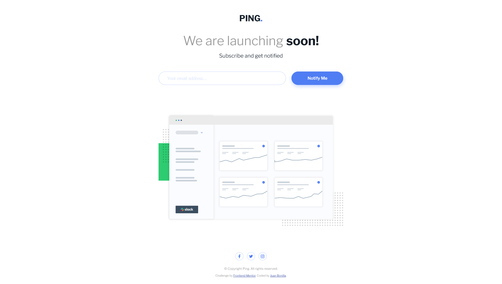

# Frontend Mentor - Ping coming soon page solution

This is a solution to the [Ping coming soon page challenge on Frontend Mentor](https://www.frontendmentor.io/challenges/ping-single-column-coming-soon-page-5cadd051fec04111f7b848da). Frontend Mentor challenges help you improve your coding skills by building realistic projects!

## Table of contents

- [Overview](#overview)
  - [The challenge](#the-challenge)
  - [Screenshot](#screenshot)
  - [Links](#links)
- [My process](#my-process)
  - [Built with](#built-with)
  - [What I learned](#what-i-learned)
  - [Continued development](#continued-development)
  - [Useful resources](#useful-resources)
- [Author](#author)

## Overview

### The challenge

Users should be able to:

- View the optimal layout for the site depending on their device's screen size
- See hover states for all interactive elements on the page
- Submit their email address using an `input` field
- Receive an error message when the `form` is submitted if:
	- The `input` field is empty. The message for this error should say *"Whoops! It looks like you forgot to add your email"*
	- The email address is not formatted correctly (i.e. a correct email address should have this structure: `name@host.tld`). The message for this error should say *"Please provide a valid email address"*

### Screenshot

Desktop view



### Links

- Solution URL: [Click here](https://www.frontendmentor.io/solutions/mobilefirst-site-html5-scss-flexbox-and-js-AxdoI1-AR)
- Live Site URL: [See live site here](https://juanbonilla.me/FEM_ping-coming-soon-page/)

## My process

### Built with

- Semantic HTML5 markup
- CSS / SCSS custom properties
- Flexbox
- Mobile-first workflow
- [Font Awesome](https://fontawesome.com/) - Icons library

### What I learned

Recently, I have been curious about accessibility and luckily I found a way to transform icons implementation to be accessible by the screen reader that some people could use to navigate through my page. See below:

In this case, the `aria-hidden` attribute helps to prevent screen readers to try reading the icon. Instead, it will read the content inside the `span`:
```html
<div class="icon">
  <a href="#">
    <i class="instagram" aria-hidden="true"></i>
    <span class="sr-only">Instagram</span>
  </a>
</div> 
```
For the above `span` this class will apply (it hides from *user view* but it could be accessed by the *screen reader*):
```scss
.sr-only {
  position: absolute;
  border: 0;
  width: 1px;
  height: 1px;
  margin: -1px;
  overflow: hidden;
  padding: 0;
}
```

### Continued development

In my opinion, its an interesting opportunity to go deeper inside the accessibility specs to help as much users as possible to be able to use my web sites. 

On the other hand, I still want to improve my skills in SCSS.

### Useful resources

- [Accessibility: Issues, Tips, Tools](https://www.youtube.com/watch?v=k_XT1qqgsH4) - This helped me to apply a trick to improve the accesibility of my document, I learned the importance of using this tool for screen readers when reading icons.
- [How to use Font Awesome icons with SASS/SCSS](https://www.youtube.com/watch?v=7C9H0EzPxl8) - This video show me how to implement Font Awesome icons in my solution with SCSS.

## Author

- Website - [juanbonilla.me](https://juanbonilla.me)
- Frontend Mentor - [@juanpb96](https://www.frontendmentor.io/profile/juanpb96)
- LinkedIn - [Juan Bonilla](https://www.linkedin.com/in/juan-pablo-bonilla-6b8730115/)